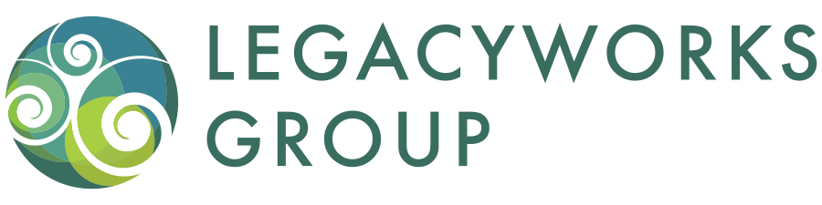

Use this page to search for which currently-available trainings leverage the selected core competencies. To narrow your seach, simply click the core competency of interest in the sidebar on the right of the screen and the list of trainings will be reduced to only those that incorporate the specified competency.

If you need a refresher on which of the four categories ( Values,  Skills,  Stewardship, and  Results) each core competency falls into, or performance indicators for a specific core competency, check out the [glossary](https://legacyworksgroup.github.io/learning-catalog/glossary.html) (also accessible from the sidebar on the left of this screen).

 

