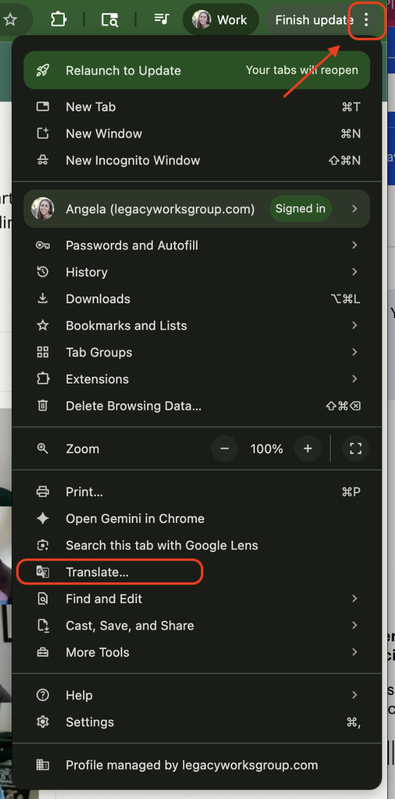
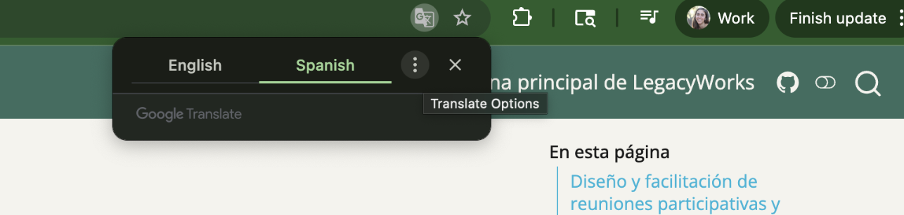
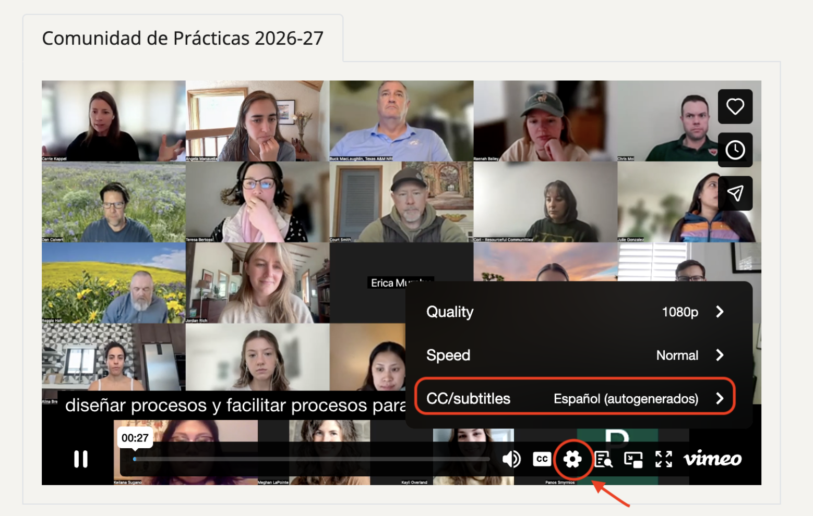
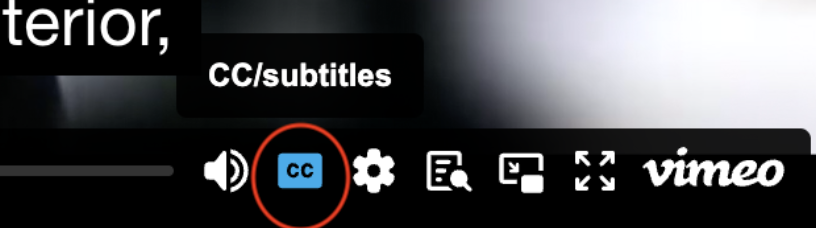

## _Cómo traducir idiomas_ | How to Translate Language

:::{.panel-tabset}
### En un navegador web de Google

1. En la esquina superior derecha de la página web, haz clic en los tres puntos junto a Finalizar actualización. Haz clic en Traducir.

{fig-alt="Screenshot of Google Chrome settings window open with the 'Translate' option three-quarters of the way to the bottom outlined in a red square" fig-align="center" width="30%"}

2. Seleccione un idioma. Haga clic en los tres puntos si necesita seleccionar un idioma nuevo.

{fig-alt="Screenshot of Google Chrome language choice contextual window set to 'Spanish'" fig-align="center" width="80%"}

### In a Google web browser:

1. In the top right corner of the webpage, click on the three dots next to “Finish update”. Click on “Translate”. 

{fig-alt="Screenshot of Google Chrome settings window open with the 'Translate' option three-quarters of the way to the bottom outlined in a red square" fig-align="center" width="30%"}

2. Select a language. Click on the three dots if you need to select a new language. 

{fig-alt="Screenshot of Google Chrome language choice contextual window set to 'Spanish'" fig-align="center" width="80%"}

:::

:::{.panel-tabset}
### En las grabaciones de la comunidad de práctica

1. Haz clic en el icono de Configuración. Haz clic en CC/Subtítulos  Selecciona tu idioma.

{fig-alt="Screenshot of Vimeo playback window with the Settings gear circled in red and the 'CC/subtitles' option set to Spanish in a red rectangle" fig-align="center" width="80%"}

2. Asegúrate de activar los subtítulos.

{fig-alt="Screenshot of Vimeo playback window where the 'CC' button is activated" fig-align="center" width="50%"}

###  In our Community of Practice recordings:

1. Click on the Settings icon. Click on “CC/Subtitles”  Select your language. 

{fig-alt="Screenshot of Vimeo playback window with the Settings gear circled in red and the 'CC/subtitles' option set to Spanish in a red rectangle" fig-align="center" width="80%"}

2. Ensure captions/subtitles are turned on.

{fig-alt="Screenshot of Vimeo playback window where the 'CC' button is activated" fig-align="center" width="50%"}

:::

